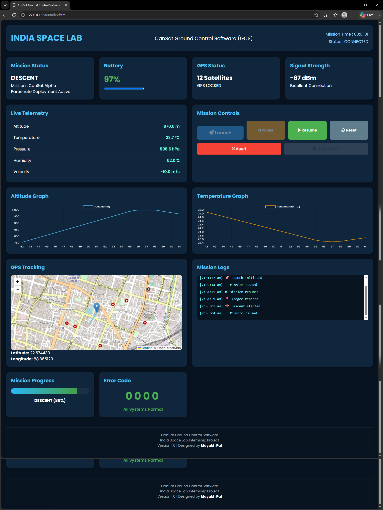
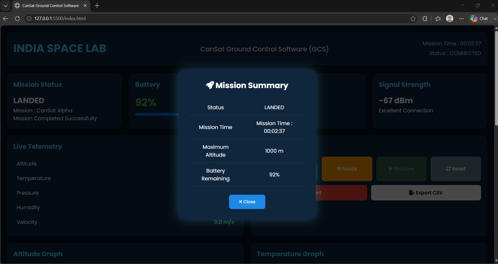
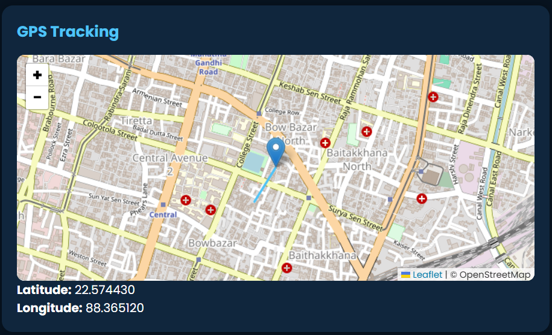
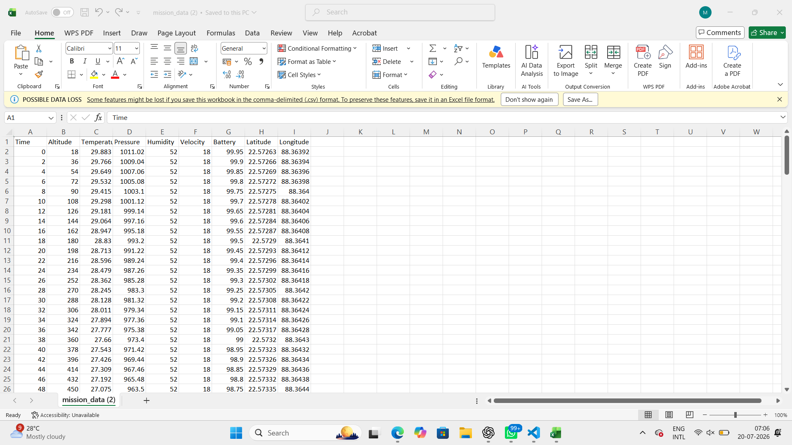

# 🚀 CanSat Ground Control Software (GCS)

A browser-based Ground Control Software developed as part of the India Space Lab Internship. The application simulates a complete CanSat mission by providing real-time telemetry visualization, mission control, GPS tracking, graphical analysis, mission logging, and telemetry export.



## 📖 Project Overview

CanSat Ground Control Software (GCS) is a web-based mission control dashboard that simulates the operation of a CanSat from launch to landing.

The application provides a realistic interface for monitoring telemetry data, tracking GPS location, visualizing mission parameters, controlling mission states, logging important events, and exporting mission data for further analysis.

The project was developed using HTML, CSS and JavaScript without any backend framework.

## 🎯 Key Highlights

- Browser-based Ground Control Software
- Real-time telemetry simulation
- GPS tracking with Leaflet
- Interactive mission control system
- Telemetry export to CSV
- Responsive user interface

## ✨ Features

- Real-time telemetry monitoring
- Live altitude and temperature graphs
- GPS tracking using Leaflet Maps
- Mission control panel
- Mission timer
- Mission progress indicator
- Battery monitoring
- Signal strength monitoring
- Mission event logging
- Error code monitoring
- Mission summary popup
- CSV telemetry export
- Responsive dashboard

## 🛠️ Technology Stack

- HTML5
- CSS3
- JavaScript (ES6)
- Chart.js
- Leaflet.js
- Font Awesome

## 📷 Screenshots

### Dashboard


### Mission Summary



### GPS Tracking



### CSV Export



## ▶️ How to Run

1. Clone the repository.

```bash
git clone https://github.com/yourusername/CanSat-GCS.git
```

2. Open the project folder.
3. Launch `index.html` in any modern web browser.

No installation or additional dependencies are required.

## 🚀 Mission Workflow

```text
READY
  ↓
ASCENT
  ↓
APOGEE
  ↓
DESCENT
  ↓
LANDED
  ↓
Mission Summary & CSV Export
```

## 🔮 Future Improvements

- Live sensor integration
- Serial communication support
- Real-time telemetry using WebSockets
- 3D CanSat orientation visualization
- Multiple mission support
- Cloud telemetry storage

## 👨‍💻 Author

**Mayukh Pal**
B.Tech Computer Science & Engineering
India Space Lab Internship Project

## 🌐 Live Demo

Coming Soon


